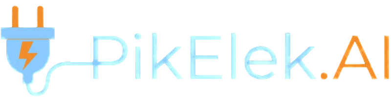

<p align="center">
  
</p>  

<h3 align="center">Electricity peak and consumption forecasts for France.</h3>
 
<p align="center" style="font-size: 25px">
  🔗 <strong>Live app :<a target="_blank"href="https://pikelek.com"> pikelek.com</a></strong>
</p>
  
</br>
</br>
<p align="center">
  
  
  
  
  

</p>

---

## What is the project?

PikElek.AI is a web application that **forecasts electricity consumption in France for the next 5 hours**, with a new prediction every 30 minutes
and **gives an analysis** of the **trend** (increasing, decreasing, or stable), possible **consumption spikes**, and the **maximum value expected** in the next hours.  
It also shows on the chart the historical consumption curve together with the forecasted values.

You can try it live at **[pikelek.com](https://pikelek.com)**.

---

## Why I built this project

I wanted to build and manage a complete AI project, from the raw data to a real online product, in a field I really like, which is **energy**.

I was inspired by the tool made by **RTE France**, which predicts the electricity consumption for the day. My goal was to build something similar, but focused on **short-term forecasting**: predicting the next 5 hours, in 30-minute steps.

This project was also a way to go further than "just training a model in a notebook." I wanted to learn how to take a model from training to a **real, working, online application**, the way it would be done in a professional environment: with an API, a database, containers, and a server running 24/7.

---

## How it works

The project is made of several parts that work together:

1. **Scheduler** - A Python script uses `APScheduler` (a cron job built into the code) to run automatically every 30 minutes (at HH:00 or HH:30).
2. **Data collection** - At each run, the scheduler gets fresh data from several external APIs:
   - **Open-Meteo** API for weather data
   - **Government APIs** for school holidays and public holidays
   
   This data is used to build the dataframe needed for the prediction: the next **10 time steps** (30 minutes each).
3. **Prediction** - A trained model (a **Ridge linear regression**) is loaded and used to predict the electricity consumption for the next 5 hours, in 30-minute intervals.
4. **Storage** - The forecasts and the updated historical data are saved in a **PostgreSQL** database, running in its own Docker container.
5. **API** - A **FastAPI** application (also containerized) reads the historical and forecast data from the database. It also computes and returns a summary dictionary with information such as the consumption trend, the detection of a possible peak, and the highest predicted value among the next 5 hours.
6. **Frontend** - A **Streamlit** application (containerized as well) sends HTTP requests to the FastAPI backend and displays the results: the consumption chart and the trend/peak analysis cards.

### How the analysis is computed

The `/demand` endpoint of the API doesn't just return raw numbers, it also runs a quick analysis on the current forecasts, shown on the summary cards in the app.

- **Trend** - A simple **Linear Regression** is fitted on the upcoming predictions (prediction index as X, predicted consumption as Y). The slope of this line tells us how fast consumption is expected to rise or fall, and is translated into a **Low / Medium / High** demand level using fixed thresholds.
- **Spike detection** - The API looks at the difference between each pair of consecutive predicted values (starting from the last known historical point). If the biggest jump exceeds a fixed threshold, it's flagged as a **consumption spike**, along with the value and the time it's expected to happen.
- **Highest predicted value** - The API compares the maximum value among the upcoming predictions to the last known historical value, and returns whether it represents an increase, along with the percentage change.

All of this is recomputed live from the database every time the endpoint is called, so the analysis always reflects the latest forecasts.

---

## Technologies used

 
<p align="left">
  
  
  
  
  
  
  
  
  
</p>


- **Python** - main language for the whole pipeline
- **MLflow** - experiment tracking and model management during training
- **Ridge Regression** (Scikit-learn) - the forecasting model
- **APScheduler** - automated scheduling of the prediction pipeline
- **PostgreSQL** - database for historical and forecast data
- **FastAPI** - backend API serving the data
- **Streamlit** - frontend web application
- **Docker & Docker Compose** - containerization of PostgreSQL, FastAPI, and Streamlit
- **AWS EC2** - cloud server hosting the whole application
- **Nginx** - reverse proxy and HTTPS certificate management

---

## How to try it

There are two ways to try PikElek AI:

### 1. Online
Just go to **[pikelek.com](https://pikelek.com)** and see the live forecasts directly in your browser.

### 2. Locally, with Docker
```bash
# Clone the repository
git clone <repo-url>
cd <repo-folder>

# Build and start all the containers
docker compose up --build
```
Once the containers are running, open your browser and go to:
```
http://localhost:8501
```
to access the Streamlit web app locally.

---

## What I learned

This project was my second real end-to-end machine learning project, and I learned a lot along the way:

- How to manage a **complete time series project**: adapting the raw datasets to build a dataset suitable for time series forecasting, while being careful to **avoid data leakage** and **multicollinearity** between features.
- How to use **MLflow** to track experiments and manage trained models.
- How to **deploy a project online**: discovering FastAPI, making requests to external APIs, using Docker and Docker Compose to containerize an application, and deploying everything on an **AWS EC2 instance**.